# ROADMAP — Projeto PDV (Fortaleza de Portfólio)

Meu guia de **visão** — não é onde codar item a item. Para executar: [`milestones/`](./milestones/README.md) → [`tasks/`](./tasks/M00/) → PR → ADR (se couber) → [`journal/`](./journal/README.md).

Cada milestone resolve um **problema** criado pelo anterior. Cada task dura **2–6 horas**. Penso em **histórias de negócio completas**, não em “terminar uma tecnologia”.

**Meus objetivos:**

1. Construir um PDV com microserviços, mensageria, cache, testes e CI de nível profissional.
2. Implementar um **motor de sincronização** entre sistemas (2 bancos, delta, cancelamentos, emissões, retentativas, histórico).

---

## Como uso este repositório de docs

| Nível     | Onde                        | Papel                                    |
| --------- | --------------------------- | ---------------------------------------- |
| Visão     | `ROADMAP.md` (este arquivo) | Por quê, arquitetura, histórias          |
| Milestone | `milestones/MXX-*.md`       | Entrega demonstrável                     |
| Task      | `tasks/MXX/TYYY-*.md`       | Ticket de 2–6h — escopo do “chefe”       |
| ADR       | `ADR/`                      | Só quando **rejeitei alternativa séria** |
| Journal   | `journal/`                  | Retrospectiva pós-milestone              |

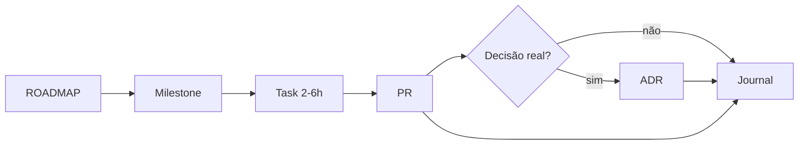

**Minha regra:** uma task por sessão de foco. Milestone grande = abrir tasks, não engolir o ROADMAP.

---

## Histórias de negócio (a narrativa do projeto)

| #     | História                     | Fim = demonstrar…               | Milestones |
| ----- | ---------------------------- | ------------------------------- | ---------- |
| **1** | Um produto foi criado        | CRUD + estoque + movimentação   | M01, M02   |
| **2** | Esse produto chegou ao PDV   | estoque → outbox → Rabbit → PDV | M04, M05   |
| **3** | Esse produto foi vendido     | Venda confirmada com snapshot   | M07        |
| **4** | O estoque baixou             | Saída registrada (saga feliz)   | M07        |
| **5** | A venda foi cancelada        | Estorno no estoque              | M07        |
| **6** | O ERP descobriu essa mudança | Sync ERP → PDV                  | M10, M11   |

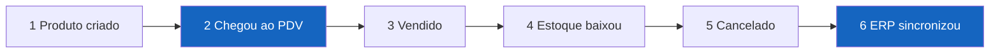

---

## Milestones por fase

Índice completo: [`milestones/README.md`](./milestones/README.md).

| Fase              | Milestones   | Fecha                                      |
| ----------------- | ------------ | ------------------------------------------ |
| **Fundação**      | M00, M01     | pnpm + postgres + estoque base             |
| **Domínio**       | M02, **M06** | Estoque; Shared Kernel **após** PDV        |
| **Integração**    | M03, M05     | Compose; **1º E2E**                        |
| **Mensageria**    | M04, M08     | Outbox, Rabbit, **correlation id**; BullMQ |
| **Consistência**  | M07, M09     | Saga; cache                                |
| **Sincronização** | M10, M11     | Sync MVP + completo                        |
| **Operação**      | M12–M15      | OTel, auth, CI, produção                   |

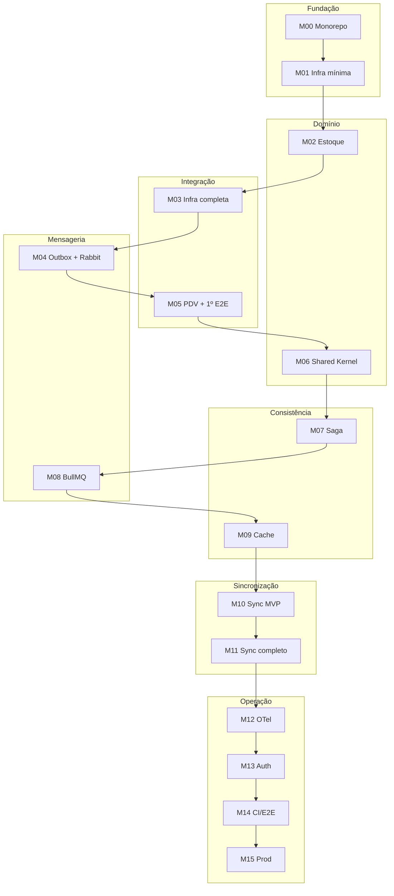

### Decisões de ordem (v3)

| Mudança                          | Motivo                                                                   |
| -------------------------------- | ------------------------------------------------------------------------ |
| Shared Kernel **M06** (após PDV) | Extraio quando **dois serviços** duplicam — abstração nasce da repetição |
| **Correlation id em M04**        | 1º consumer quebrar → preciso rastrear; OTel full em M12                 |
| **Milestones + tasks**           | ROADMAP = visão; execução em tickets 2–6h                                |
| **Histórias explícitas**         | Portfólio mostra domínio, não só infra                                   |

**Deixo para depois (pós-M15):** API Gateway, CQRS, k6, frontend React.

---

## Decisões que já tomei (não reabro sem ADR)

| Tema                            | Escolha                                 | Motivo                                                      |
| ------------------------------- | --------------------------------------- | ----------------------------------------------------------- |
| Package manager                 | **pnpm workspaces**                     | Hoisting previsível, `workspace:*`, alinhado ao `shared.md` |
| Testes integração               | **Testcontainers** (+ compose para dev) | Postgres/Rabbit/Redis sobem no teste; CI reproduzível       |
| Eventos entre serviços          | **RabbitMQ**                            | Routing, DLQ, padrão enterprise                             |
| Jobs internos / retry local     | **BullMQ + Redis**                      | Backoff, dashboard, workers separados                       |
| Cache                           | **Redis**                               | Leitura quente + backend BullMQ                             |
| Banco                           | **1 PostgreSQL por microserviço**       | Isolamento real de bounded context                          |
| Publicação de eventos confiável | **Outbox Pattern**                      | Evento + persistência na mesma transação                    |
| Documentação de decisões        | **ADRs em `docs/ADR/`**                 | Só quando rejeitei alternativa séria (ver regra abaixo)     |

### Regra de ADR

**Só escrevo ADR quando rejeitei pelo menos uma alternativa séria.**

Exemplo RabbitMQ: comparei Redis Streams e Kafka; escolhi Rabbit; documento motivos.

Sem decisão real → sem ADR. Journal basta.

### Extras “canhão” que priorizei

Escolhi estes pelo impacto arquitetural e aderência ao domínio do meu PDV:

| #   | Extra                          | Por quê                                                |
| --- | ------------------------------ | ------------------------------------------------------ |
| 1   | **Outbox Pattern**             | Evento + DB na mesma transação; base de sync confiável |
| 2   | **Microserviço `sync-engine`** | 2 bancos, cursor, delta, retry, auditoria completa     |
| 3   | **Saga por coreografia**       | Venda → estoque → compensação se falhar (cancelamento) |
| 4   | **ADRs**                       | Explica _por que_ RabbitMQ, por que outbox, etc.       |
| 5   | **E2E de um fluxo crítico**    | Prova que o projeto funciona de ponta a ponta          |

---

## O que quero no motor de sincronização

| Capacidade            | Como vou implementar                                              |
| --------------------- | ----------------------------------------------------------------- |
| Pedidos novos         | Sync puxa vendas novas do ERP simulado → PDV                      |
| Detecção de mudanças  | Comparação por `updated_at` + hash do payload / version column    |
| Cancelamentos         | Evento `pedido.cancelado` + saga de compensação (estorna estoque) |
| Emissão de nota       | Evento `nota.emitida` + estado na máquina de estados do pedido    |
| Transações            | Outbox + unit of work por lote de sync                            |
| Histórico / auditoria | Tabelas `sync_run`, `sync_item_log`, `sync_state`                 |
| Logs de erro          | `sync_error` + dead letter + correlation id                       |
| Retentativas          | BullMQ com backoff + idempotency key                              |
| Orientação a eventos  | RabbitMQ + contratos Zod em `@scope/events-contracts`             |
| Bancos isolados       | `postgres-erp` + `postgres-pdv` (+ estoque com o dele)            |

---

## Minha visão arquitetural

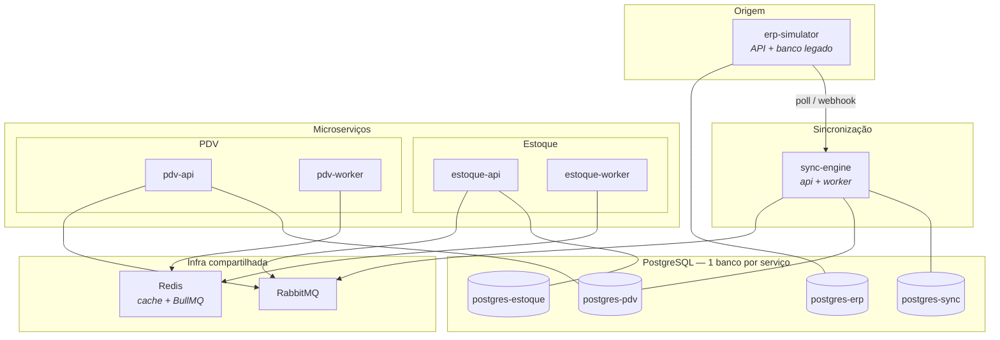

---

## Como uso cada ferramenta

| Ferramenta      | Uso para                                        | Evito usar para                  |
| --------------- | ----------------------------------------------- | -------------------------------- |
| PostgreSQL (×N) | Fonte da verdade de cada contexto               | JOIN entre serviços              |
| RabbitMQ        | Eventos de domínio entre serviços               | Fila de retry interna            |
| BullMQ          | Jobs do sync, IA, relatórios, republicar outbox | Comunicação principal entre APIs |
| Redis           | Cache + backend BullMQ                          | Persistir pedido/venda           |
| Testcontainers  | Testes integração no CI                         | Dev day-to-day (prefiro compose) |
| Zod             | Borda HTTP + contratos de eventos               | Regras de domínio profundas      |

---

## Meus bounded contexts

### `estoque-microservico`

- **Dono de:** Produto, Departamento, Estoque, Movimentação
- **Publica:** `estoque.produto.criado`, `estoque.quantidade.alterada`
- **Consome:** `pdv.venda.finalizada`, `pdv.venda.cancelada` (compensação)

### `pdv-microservico`

- **Dono de:** Venda, ItemVenda, Pagamento, Caixa, EstadoPedido
- **Não duplico** cadastro completo — guardo snapshot na venda (`produtoId`, `nome`, `preco` no momento)
- **Publica:** `pdv.venda.finalizada`, `pdv.venda.cancelada`, `pdv.nota.solicitada`
- **Consome:** eventos de estoque (cache catálogo)

### `sync-engine`

- **Dono de:** cursor de sync, runs, logs, erros, idempotência, outbox de republicação
- **Lê:** banco ERP simulado (origem)
- **Escreve:** banco PDV (destino) + publico eventos quando aplicável
- **Não substituo** domínio do PDV — orquestro **replicação/sincronização**

### `erp-simulator` (opcional, leve)

- API + DB com schema “legado” de pedidos
- Gero pedidos fake, updates, cancelamentos, emissões de nota
- Testo sync sem depender de sistema externo real

### Shared Kernel (`packages/`)

| Pacote                    | Conteúdo                       | Ciclo          |
| ------------------------- | ------------------------------ | -------------- |
| `@scope/domain-errors`    | `ErroRegraNegocio`, hierarquia | M06 (após PDV) |
| `@scope/money`            | VO `Preco`                     | M06            |
| `@scope/events-contracts` | Zod + nomes exchanges/queues   | M04            |
| `@gab-szz/pdv-schemas`    | `idSchema`, primitivos HTTP    | contínuo       |

Detalhes em [`shared.md`](../shared.md).

---

## Meus bancos: dev / test / prod

| Serviço       | Dev               | Test (CI)          | Prod          |
| ------------- | ----------------- | ------------------ | ------------- |
| estoque       | `pdv_estoque_dev` | `pdv_estoque_test` | `pdv_estoque` |
| pdv           | `pdv_vendas_dev`  | `pdv_vendas_test`  | `pdv_vendas`  |
| sync-engine   | `pdv_sync_dev`    | `pdv_sync_test`    | `pdv_sync`    |
| erp-simulator | `pdv_erp_dev`     | `pdv_erp_test`     | `pdv_erp`     |

### Variáveis por ambiente (cada serviço)

```env
AMBIENTE=desenvolvimento | test | producao
DATABASE_URL=postgresql://...
REDIS_URL=redis://...
RABBITMQ_URL=amqp://...
```

### Scripts que replico em cada serviço

| Script            | Função                        |
| ----------------- | ----------------------------- |
| `db:migrate`      | Drizzle migrate (dev)         |
| `db:migrate:test` | Migrate no banco test         |
| `db:seed:dev`     | Dados fake                    |
| `db:reset:test`   | Drop + migrate antes da suite |

---

## Minha pirâmide de testes

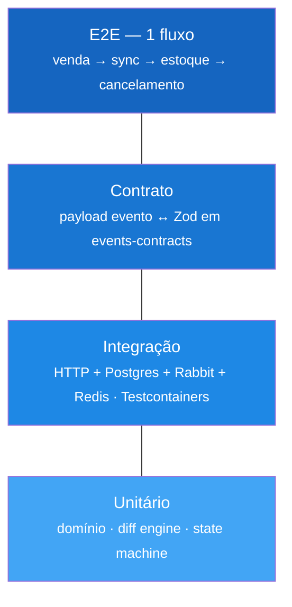

| Tipo       | Exemplos no meu projeto                                                        |
| ---------- | ------------------------------------------------------------------------------ |
| Unit       | `Produto.criar`, `calcularDelta(pedidoAntigo, pedidoNovo)`, máquina de estados |
| Integração | POST `/produtos`, sync run completo, consumer Rabbit                           |
| Contrato   | `PedidoAtualizadoV1` parseia payload golden                                    |
| E2E        | ERP cria pedido → sync → PDV → venda finaliza → estoque baixa                  |

---

# Execução — milestones e tasks

Checklists detalhados **não** ficam aqui. Uso:

| Recurso           | Caminho                                                      |
| ----------------- | ------------------------------------------------------------ |
| Índice milestones | [`milestones/README.md`](./milestones/README.md)             |
| Milestone atual   | [`milestones/M00-monorepo.md`](./milestones/M00-monorepo.md) |
| Tasks M00         | [`tasks/M00/`](./tasks/M00/)                                 |
| Template task     | [`TASK-TEMPLATE.md`](./TASK-TEMPLATE.md)                     |
| Retrospectiva     | [`journal/TEMPLATE.md`](./journal/TEMPLATE.md)               |

**Regra de task:** 2–6 horas. Maior → dividir ou virar milestone.

**Milestone atual:** M00 Monorepo _(parcial)_

---

# Referência: Outbox

_Milestone: [M04](./milestones/M04-mensageria-outbox.md)_

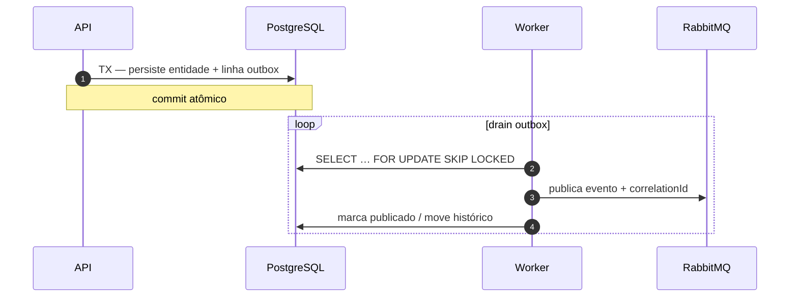

---

# Referência: Saga

_Milestone: [M07](./milestones/M07-saga.md)_

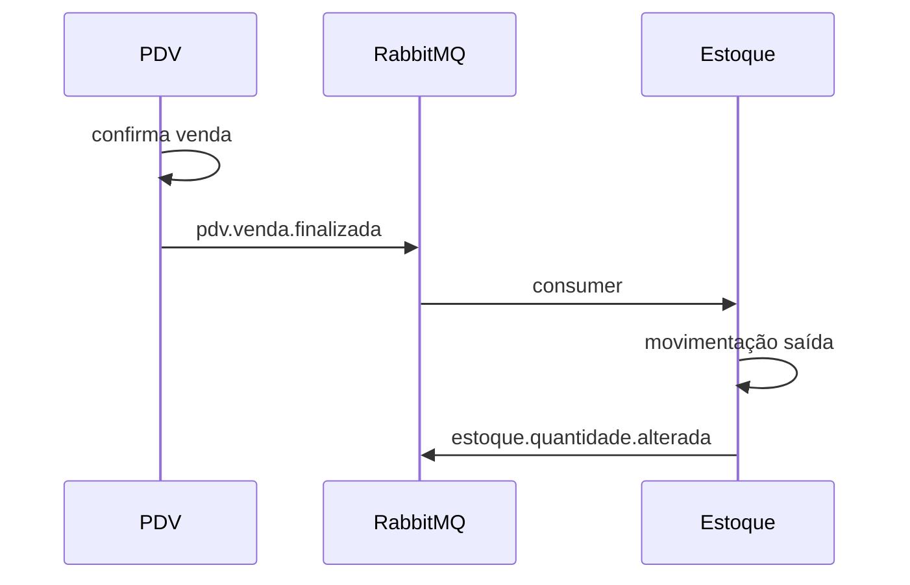

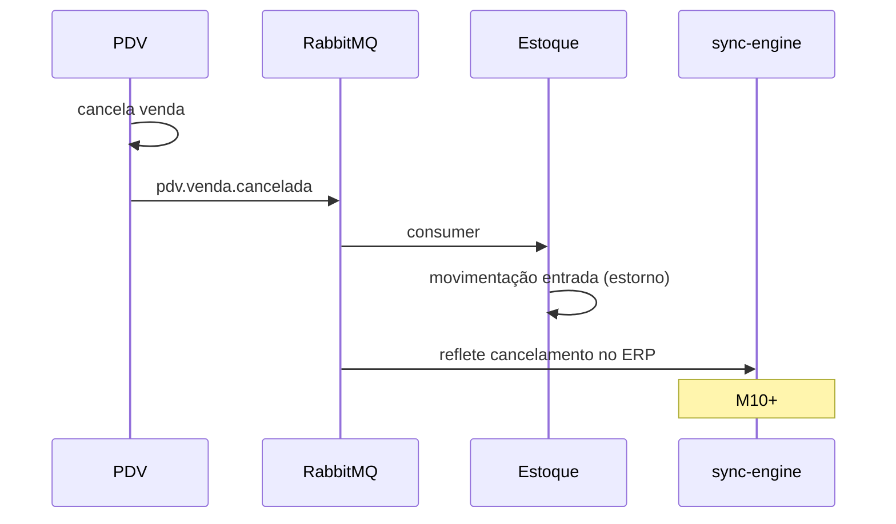

---

# Referência: meu Sync Engine

## Pipeline passo a passo

```typescript
// Pseudocódigo — implemento na M10+

async function executarSyncRun(stream: "pedidos") {
  const run = await syncRunRepo.iniciar(stream);
  try {
    const cursor = await cursorRepo.obter(stream);
    const lote = await erpGateway.buscarAlterados(cursor, { limit: 50 });

    for (const item of lote) {
      await processarItem(run, item); // idempotente
    }

    await cursorRepo.avancar(stream, lote);
    await syncRunRepo.finalizar(run, "sucesso");
  } catch (e) {
    await syncRunRepo.finalizar(run, "falha", e);
    throw e;
  }
}

async function processarItem(run, itemExterno) {
  const key = `pedido:${itemExterno.id}:${itemExterno.version}`;
  if (await idempotencyRepo.jaAplicado(key)) return;

  const destino = await pdvRepo.buscarPorExternalId(itemExterno.id);
  const acao = diffEngine.resolver(destino, itemExterno);

  await db.transaction(async (tx) => {
    await aplicarAcao(tx, acao);
    await syncItemLogRepo.registrar(tx, run, acao);
    await idempotencyRepo.marcar(tx, key);
    await outboxRepo.enfileirarEvento(tx, acao.evento);
  });
}
```

## Máquina de estados do pedido (PDV)

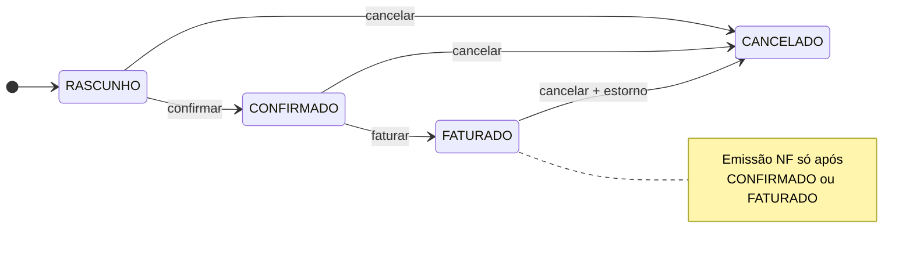

Minhas regras de negócio:

- Não cancelo `FATURADO` sem fluxo de estorno
- O sync respeita transições (não “pula” estado via UPDATE cego)
- Emissão NF só de `CONFIRMADO` ou `FATURADO` (documento em ADR)

## Tratamento de erro

| Tipo       | Exemplo                  | Ação                                   |
| ---------- | ------------------------ | -------------------------------------- |
| Retryável  | ERP timeout, PG deadlock | `sync_error` + BullMQ retry            |
| Permanente | Schema inválido, FK      | DLQ + alerta; não retry infinito       |
| Parcial    | 3 de 50 falharam         | run `parcial`; cursor avança só dos ok |

---

# Fluxos de negócio (diagramas)

## Cadastro produto com outbox

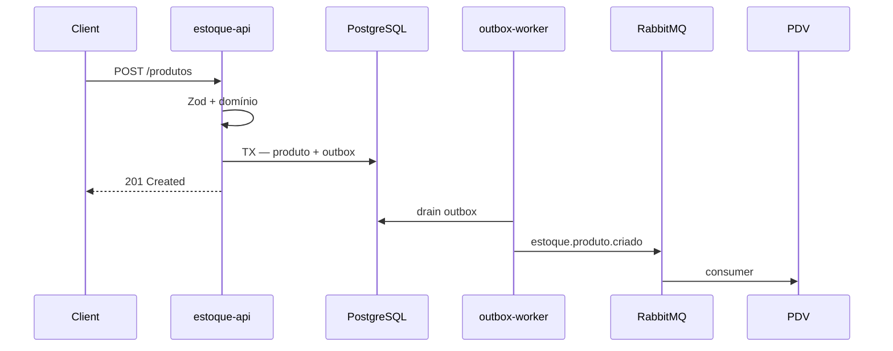

## Venda com saga

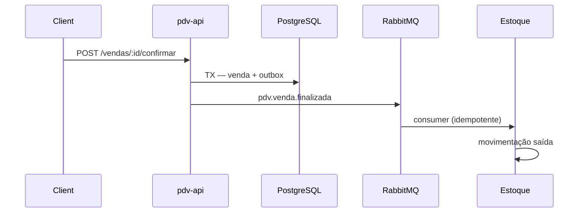

## Sync run (ERP → PDV)

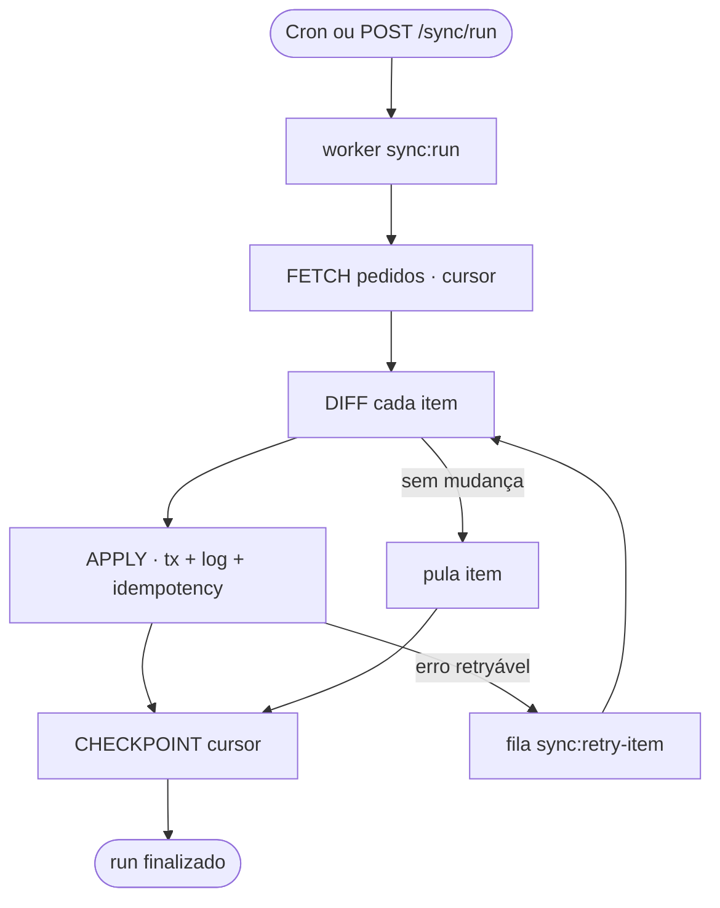

---

# Estrutura de pastas que estou montando

```mermaid
flowchart TD
  ROOT[Projeto-PDV]

  ROOT --> DOCKER[docker/]
  ROOT --> DOCS[docs/]
  ROOT --> PACKAGES[packages/]
  ROOT --> ESTOQUE[estoque-microservico/]
  ROOT --> PDV[pdv-microservico/]
  ROOT --> SYNC[sync-engine/]
  ROOT --> ERP[erp-simulator/]
  ROOT --> GH[.github/workflows/]
  ROOT --> ROOT_FILES[pnpm-workspace.yaml · package.json]

  DOCKER --> D1[compose.dev.yml]
  DOCKER --> D2[compose.test.yml]
  DOCKER --> D3[compose.full.yml]

  DOCS --> ROADMAP[ROADMAP.md]
  DOCS --> MS[milestones/]
  DOCS --> TK[tasks/]
  DOCS --> JN[journal/]
  DOCS --> ADR[ADR/]
  DOCS --> TPL[TASK-TEMPLATE.md]

  PACKAGES --> P1[domain-errors/]
  PACKAGES --> P2[money/]
  PACKAGES --> P3[events-contracts/]
  PACKAGES --> P4[pdv-schemas/]

  GH --> CI[ci.yml]

  style ROOT fill:#263238,color:#fff
  style DOCKER fill:#37474f,color:#fff
  style DOCS fill:#37474f,color:#fff
  style PACKAGES fill:#37474f,color:#fff
  style SYNC fill:#1565c0,color:#fff
```

---

# Anti-padrões que evito

1. **Dois serviços no mesmo banco** compartilhando tabelas de negócio
2. **RabbitMQ e Redis Pub/Sub** para o mesmo evento
3. **BullMQ entre microserviços** (uso Rabbit)
4. **`@scope/shared`** genérico — prefiro pacotes pequenos e nomeados
5. **Teste de integração mockando tudo** — subo container real
6. **Sync sem idempotency key** — re-run duplica pedidos
7. **Cursor avançando antes do commit** — perda de dados em crash
8. **Retry infinito** em erro permanente — uso DLQ
9. **Shared Kernel antes de dois consumidores** — extraio em M06, quando duplicar doer
10. **ADR sem alternativa rejeitada** — journal basta
11. **Dez ferramentas antes do 1º E2E** — história 2 (M05) vem cedo; E2E full em M14

---

# Próximo passo

Abrir **[M00 — Monorepo](./milestones/M00-monorepo.md)** → task **[T001 pnpm](./tasks/M00/T001-pnpm-workspaces.md)**.

---

# Documentos relacionados

| Arquivo                                                               | Conteúdo                 |
| --------------------------------------------------------------------- | ------------------------ |
| [`milestones/README.md`](./milestones/README.md)                      | Índice M00–M15           |
| [`TASK-TEMPLATE.md`](./TASK-TEMPLATE.md)                              | Cabeçalho padrão de task |
| [`journal/README.md`](./journal/README.md)                            | Retrospectivas           |
| [`shared.md`](../shared.md)                                           | Shared Kernel, pnpm      |
| [`ADR/README.md`](./ADR/README.md)                                    | Quando escrever ADR      |
| [`estoque-microservico/README.md`](../estoque-microservico/README.md) | ER estoque               |

---

# Glossário

| Termo           | Significado                                                         |
| --------------- | ------------------------------------------------------------------- |
| Outbox          | Tabela outbox na mesma TX do negócio; worker publica no broker      |
| Cursor          | Marcador do último registro syncado (`updated_at`, `id`, `version`) |
| Idempotency key | Chave única para não aplicar a mesma mudança duas vezes             |
| DLQ             | Dead Letter Queue — mensagens/jobs que falharam após N tentativas   |
| Snapshot        | Cópia dos dados no momento da venda (preço/nome), imutável          |
| Coreografia     | Saga sem orchestrator central; serviços reagem a eventos            |

---

_Última atualização: roadmap v3 — histórias + milestones + tasks._
