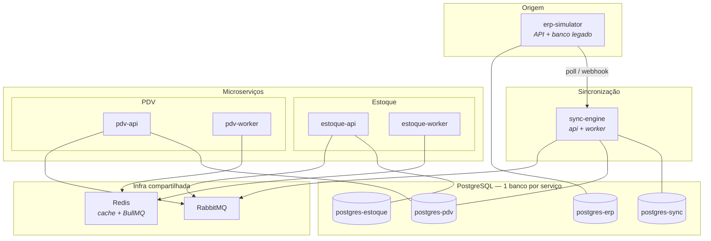
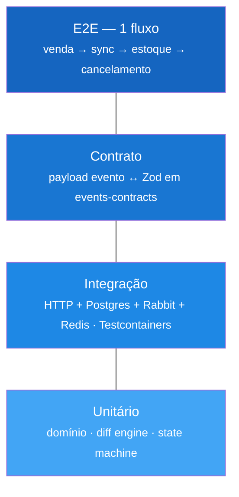
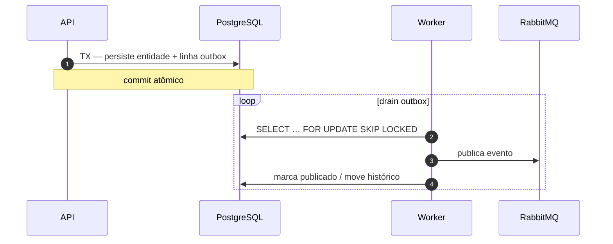
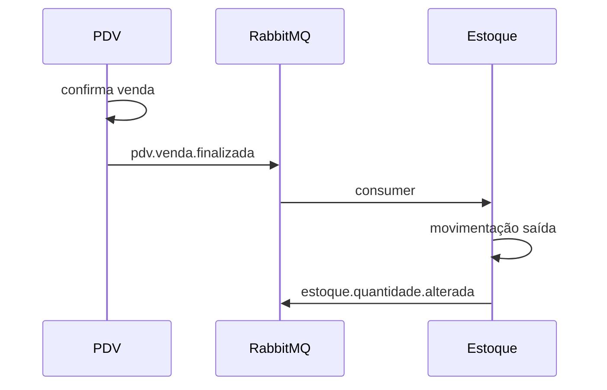
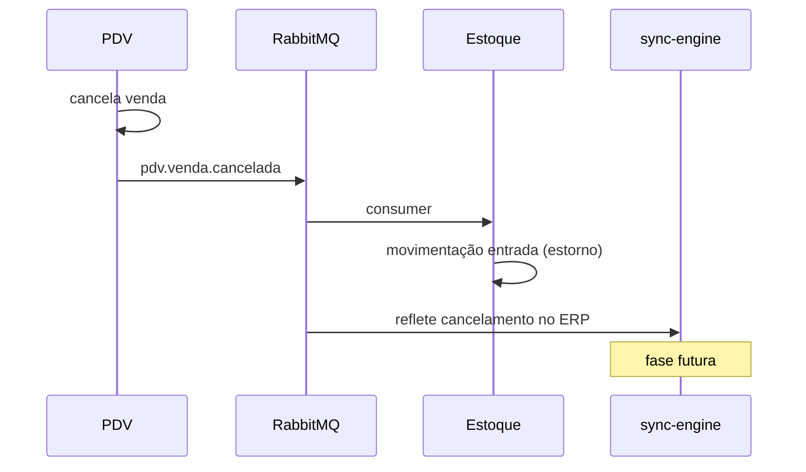
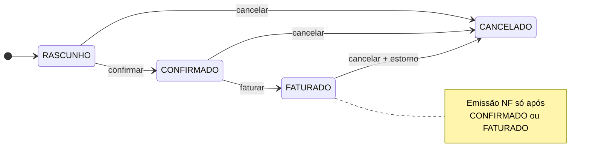
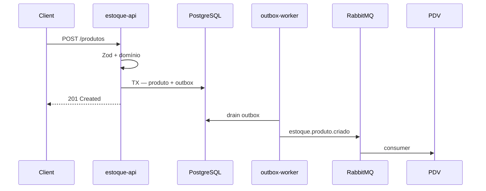
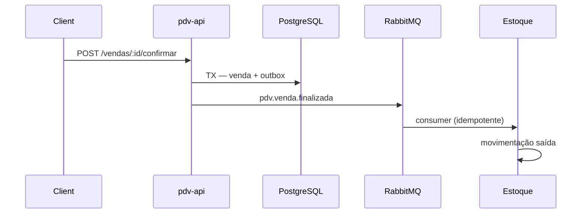
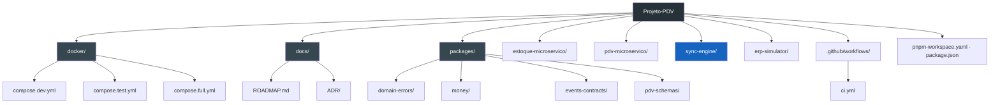

# ROADMAP — Projeto PDV (Fortaleza de Portfólio)

Meu guia mestre de implementação. Trato cada onda como um entregável demonstrável — não ligo dez ferramentas antes de fechar um fluxo ponta a ponta.

**Meus objetivos:**

1. Construir um PDV com microserviços, mensageria, cache, testes e CI de nível profissional.
2. Implementar um **motor de sincronização** entre sistemas (2 bancos, delta, cancelamentos, emissões, retentativas, histórico).

---

## Como uso este documento

| Ritmo                   | O que faço                                                               |
| ----------------------- | ------------------------------------------------------------------------ |
| Antes de codar uma onda | Leio a seção inteira + DoD                                               |
| Durante                 | Marco checkboxes; 1 PR/commit lógico por bloco                           |
| Depois                  | Escrevo ADR se houve decisão importante                                  |
| Travou                  | Consulto anti-padrões (final) + docs existentes (`shared.md`, guias Zod) |

**Minha regra:** não pular ondas. O motor de sync (Ondas 5–7) só faz sentido com estoque + PDV + infra já de pé.

---

## Decisões que já tomei (não reabro sem ADR)

| Tema                            | Escolha                                 | Motivo                                                      |
| ------------------------------- | --------------------------------------- | ----------------------------------------------------------- |
| Package manager                 | **pnpm workspaces**                     | Hoisting previsível, `workspace:*`, alinhado ao `shared.md` |
| Testes integração               | **Testcontainers** (+ compose para dev) | Postgres/Rabbit/Redis sobem no teste; CI reproduzível       |
| Eventos entre serviços          | **RabbitMQ**                            | Routing, DLQ, padrão enterprise                             |
| Jobs internos / retry local     | **BullMQ + Redis**                      | Backoff, dashboard, workers separados                       |
| Cache                           | **Redis**                               | Leitura quente + backend BullMQ                             |
| Banco                           | **1 PostgreSQL por microserviço**       | Isolamento real de bounded context                          |
| Publicação de eventos confiável | **Outbox Pattern**                      | Evento + persistência na mesma transação                    |
| Documentação de decisões        | **ADRs em `docs/ADR/`**                 | Registro explícito de trade-offs arquiteturais              |

### Extras “canhão” que priorizei

Escolhi estes pelo impacto arquitetural e aderência ao domínio do meu PDV:

| #   | Extra                          | Por quê                                                |
| --- | ------------------------------ | ------------------------------------------------------ |
| 1   | **Outbox Pattern**             | Evento + DB na mesma transação; base de sync confiável |
| 2   | **Microserviço `sync-engine`** | 2 bancos, cursor, delta, retry, auditoria completa     |
| 3   | **Saga por coreografia**       | Venda → estoque → compensação se falhar (cancelamento) |
| 4   | **ADRs**                       | Explica _por que_ RabbitMQ, por que outbox, etc.       |
| 5   | **E2E de um fluxo crítico**    | Prova que o projeto funciona de ponta a ponta          |

**Deixo para depois (Onda 11+):** API Gateway, CQRS completo, k6/load test, frontend React.

---

## O que quero no motor de sincronização

| Capacidade            | Como vou implementar                                              |
| --------------------- | ----------------------------------------------------------------- |
| Pedidos novos         | Sync puxa vendas novas do ERP simulado → PDV                      |
| Detecção de mudanças  | Comparação por `updated_at` + hash do payload / version column    |
| Cancelamentos         | Evento `pedido.cancelado` + saga de compensação (estorna estoque) |
| Emissão de nota       | Evento `nota.emitida` + estado na máquina de estados do pedido    |
| Transações            | Outbox + unit of work por lote de sync                            |
| Histórico / auditoria | Tabelas `sync_run`, `sync_item_log`, `sync_state`                 |
| Logs de erro          | `sync_error` + dead letter + correlation id                       |
| Retentativas          | BullMQ com backoff + idempotency key                              |
| Orientação a eventos  | RabbitMQ + contratos Zod em `@scope/events-contracts`             |
| Bancos isolados       | `postgres-erp` + `postgres-pdv` (+ estoque com o dele)            |

---

## Minha visão arquitetural



---

## Como uso cada ferramenta

| Ferramenta      | Uso para                                        | Evito usar para                  |
| --------------- | ----------------------------------------------- | -------------------------------- |
| PostgreSQL (×N) | Fonte da verdade de cada contexto               | JOIN entre serviços              |
| RabbitMQ        | Eventos de domínio entre serviços               | Fila de retry interna            |
| BullMQ          | Jobs do sync, IA, relatórios, republicar outbox | Comunicação principal entre APIs |
| Redis           | Cache + backend BullMQ                          | Persistir pedido/venda           |
| Testcontainers  | Testes integração no CI                         | Dev day-to-day (prefiro compose) |
| Zod             | Borda HTTP + contratos de eventos               | Regras de domínio profundas      |

---

## Meus bounded contexts

### `estoque-microservico`

- **Dono de:** Produto, Departamento, Estoque, Movimentação
- **Publica:** `estoque.produto.criado`, `estoque.quantidade.alterada`
- **Consome:** `pdv.venda.finalizada`, `pdv.venda.cancelada` (compensação)

### `pdv-microservico`

- **Dono de:** Venda, ItemVenda, Pagamento, Caixa, EstadoPedido
- **Não duplico** cadastro completo — guardo snapshot na venda (`produtoId`, `nome`, `preco` no momento)
- **Publica:** `pdv.venda.finalizada`, `pdv.venda.cancelada`, `pdv.nota.solicitada`
- **Consome:** eventos de estoque (cache catálogo)

### `sync-engine`

- **Dono de:** cursor de sync, runs, logs, erros, idempotência, outbox de republicação
- **Lê:** banco ERP simulado (origem)
- **Escreve:** banco PDV (destino) + publico eventos quando aplicável
- **Não substituo** domínio do PDV — orquestro **replicação/sincronização**

### `erp-simulator` (opcional, leve)

- API + DB com schema “legado” de pedidos
- Gero pedidos fake, updates, cancelamentos, emissões de nota
- Testo sync sem depender de sistema externo real

### Shared Kernel (`packages/`)

| Pacote                    | Conteúdo                       | Ciclo    |
| ------------------------- | ------------------------------ | -------- |
| `@scope/domain-errors`    | `ErroRegraNegocio`, hierarquia | 1        |
| `@scope/money`            | VO `Preco`                     | 2        |
| `@scope/events-contracts` | Zod + nomes exchanges/queues   | 3        |
| `@gab-szz/pdv-schemas`    | `idSchema`, primitivos HTTP    | contínuo |

Detalhes em [`shared.md`](../shared.md).

---

## Meus bancos: dev / test / prod

| Serviço       | Dev               | Test (CI)          | Prod          |
| ------------- | ----------------- | ------------------ | ------------- |
| estoque       | `pdv_estoque_dev` | `pdv_estoque_test` | `pdv_estoque` |
| pdv           | `pdv_vendas_dev`  | `pdv_vendas_test`  | `pdv_vendas`  |
| sync-engine   | `pdv_sync_dev`    | `pdv_sync_test`    | `pdv_sync`    |
| erp-simulator | `pdv_erp_dev`     | `pdv_erp_test`     | `pdv_erp`     |

### Variáveis por ambiente (cada serviço)

```env
AMBIENTE=desenvolvimento | test | producao
DATABASE_URL=postgresql://...
REDIS_URL=redis://...
RABBITMQ_URL=amqp://...
```

### Scripts que replico em cada serviço

| Script            | Função                        |
| ----------------- | ----------------------------- |
| `db:migrate`      | Drizzle migrate (dev)         |
| `db:migrate:test` | Migrate no banco test         |
| `db:seed:dev`     | Dados fake                    |
| `db:reset:test`   | Drop + migrate antes da suite |

---

## Minha pirâmide de testes



| Tipo       | Exemplos no meu projeto                                                        |
| ---------- | ------------------------------------------------------------------------------ |
| Unit       | `Produto.criar`, `calcularDelta(pedidoAntigo, pedidoNovo)`, máquina de estados |
| Integração | POST `/produtos`, sync run completo, consumer Rabbit                           |
| Contrato   | `PedidoAtualizadoV1` parseia payload golden                                    |
| E2E        | ERP cria pedido → sync → PDV → venda finaliza → estoque baixa                  |

---

# ONDAS DE IMPLEMENTAÇÃO

---

## Onda 0 — Fundação _(parcial ✅)_

**Meu objetivo:** monorepo estável, padrões repetíveis, estoque CRUD mínimo.

### Tarefas

- [x] Estrutura hexagonal no estoque
- [x] Zod na borda HTTP
- [x] Drizzle + migrations
- [x] Erros domínio vs Drizzle
- [ ] Migrar root para **pnpm workspaces** (`pnpm-workspace.yaml`)
- [ ] `docker/compose.dev.yml`: postgres-estoque, redis
- [ ] Health check: `GET /health` (db + redis)
- [ ] Pino ligado ao Fastify (logs JSON)
- [ ] Completar CRUD Produto + testes unitários domínio
- [ ] README raiz com diagrama e como subir

### DoD

- `pnpm install && docker compose -f docker/compose.dev.yml up` sobe infra
- CRUD departamento + produto funcionando
- `pnpm --filter estoque-microservico test` verde (unit)

---

## Onda 1 — Estoque completo

**Meu objetivo:** bounded context estoque fechado **antes** de mensageria.

### Tarefas

- [ ] Módulo Estoque (quantidade, mín/máx)
- [ ] Movimentação (entrada, saída, ajuste)
- [ ] Regra: saída não pode exceder saldo
- [ ] Soft delete consistente
- [ ] Testes integração: departamento + produto + movimentação (Testcontainers Postgres)
- [ ] Seed dev

### DoD

- API estoque autocontida
- Suite integração verde local e no CI

---

## Onda 2 — Infra local completa

**Meu objetivo:** ambiente reproduzível — quero que qualquer pessoa clone e suba sem fricção.

### `docker/compose.dev.yml`

```yaml
services:
  postgres-estoque:
  postgres-pdv:
  postgres-sync:
  postgres-erp:
  redis:
  rabbitmq: # UI :15672
  # estoque-api, pdv-api, sync-engine — fase posterior
```

### Tarefas

- [ ] Compose profiles: `dev`, `infra`, `full`
- [ ] `.env.example` por serviço + `.env.test`
- [ ] Dockerfile multi-stage funcional (estoque primeiro)
- [ ] Scripts root: `pnpm dev`, `pnpm test:all`, `pnpm infra:up`
- [ ] Banco test isolado (porta ou DB `_test`)

### DoD

- Clone fresco → infra sobe sem Postgres local instalado

---

## Onda 3 — Shared Kernel fase A + contratos

**Meu objetivo:** libs internas + fundação de eventos.

### Tarefas

- [ ] `packages/domain-errors` + consumo via `workspace:*`
- [ ] `packages/money` (extrair `Preco` do estoque)
- [ ] `packages/events-contracts` — schemas v1:
  - `estoque.produto.criado`
  - `estoque.quantidade.alterada`
  - `pdv.venda.finalizada`
  - `pdv.venda.cancelada`
- [ ] Testes unitários das libs
- [ ] (Opcional fase B) Changesets

### DoD

- Estoque importa erros e money do pacote; zero path `../../packages`

---

## Onda 4 — RabbitMQ + Outbox

**Meu objetivo:** eventos confiáveis entre serviços — base para o sync engine.

### Design Outbox



### Tarefas

- [ ] Tabela `outbox` no estoque (e depois pdv, sync)
- [ ] Exchange `pdv.domain` (topic)
- [ ] Publisher worker (BullMQ ou loop dedicado)
- [ ] Dead Letter Queue + retry policy Rabbit
- [ ] Estoque publica `estoque.produto.criado` via outbox
- [ ] Testes integração: transação + mensagem na fila
- [ ] ADR-001: RabbitMQ vs Redis Pub/Sub
- [ ] ADR-002: Outbox Pattern

### DoD

- Criar produto → registro outbox → mensagem no Rabbit → teste verde

---

## Onda 5 — PDV microserviço (mínimo)

**Meu objetivo:** segundo contexto com DB próprio; consumidor de eventos.

### Tarefas

- [ ] Bootstrap Fastify (copiar **padrão**, não domínio)
- [ ] Módulos: Caixa, Venda, ItemVenda, Pagamento
- [ ] Máquina de estados do pedido: `RASCUNHO → CONFIRMADO → FATURADO → CANCELADO`
- [ ] Snapshot de produto na venda
- [ ] Consumer: eventos estoque → cache/tabela leve
- [ ] Publica `pdv.venda.finalizada` via outbox
- [ ] Testes integração PDV

### DoD

- POST venda confirma → evento publicado → teste contrato passa

---

## Onda 6 — Saga: venda ↔ estoque

**Meu objetivo:** fluxo distribuído com compensação em cancelamentos.

### Fluxo feliz (coreografia)



### Fluxo compensação



### Tarefas

- [ ] Consumer estoque idempotente (`idempotency_key` = `vendaId`)
- [ ] Cancelamento após confirmação
- [ ] Log de saga implícita (tabela `processamento_evento`)
- [ ] Testes: venda ok + venda cancelada + duplicate event ignored
- [ ] ADR-003: Coreografia vs orquestração

### DoD

- Venda finalizada baixa estoque; cancelamento estorna; evento duplicado não duplica efeito

---

## Onda 7 — Sync Engine

**Meu objetivo:** motor de sincronização de pedidos entre ERP simulado e PDV.

### Modelo mental

O sync **não** é um CRUD — é um **pipeline**:


### Schema sugerido (`sync-engine`)

```sql
-- Controle de execução
sync_run (id, started_at, finished_at, status, cursor_from, cursor_to, stats_json)

-- Cursor por entidade/stream
sync_cursor (stream_name, last_external_id, last_updated_at, last_run_id)

-- Idempotência
sync_idempotency (key, applied_at, result_hash)

-- Auditoria por item
sync_item_log (run_id, external_id, action, payload_before, payload_after, applied_at)

-- Erros retryáveis
sync_error (run_id, external_id, error_code, message, stack, retry_count, next_retry_at)

-- Outbox (republicação)
outbox (...)
```

### Ações por tipo de mudança

| Detecção         | Ação                        | Evento opcional          |
| ---------------- | --------------------------- | ------------------------ |
| Pedido novo      | INSERT destino              | `sync.pedido.importado`  |
| Campos alterados | UPDATE + log diff           | `sync.pedido.atualizado` |
| Cancelamento     | UPDATE status + compensação | `sync.pedido.cancelado`  |
| Nota emitida     | UPDATE status NF            | `sync.nota.emitida`      |
| Sem mudança      | Skip (não escreve)          | —                        |

### Estratégias de diff (vou implementar as 3)

1. **Timestamp cursor:** `WHERE updated_at > :cursor ORDER BY updated_at`
2. **Version column:** `WHERE version > :last_version`
3. **Hash payload:** comparar SHA-256 do JSON normalizado; só aplica se diferente

### Tarefas

- [ ] Criar `sync-engine` (api + worker)
- [ ] Criar `erp-simulator` (API + seed pedidos)
- [ ] Pipeline DISCOVER → FETCH → DIFF → APPLY → CHECKPOINT
- [ ] Transação por lote (ex.: 50 pedidos) com rollback parcial documentado
- [ ] BullMQ fila `sync:run` + retry backoff
- [ ] DLQ para itens que esgotaram retry
- [ ] Histórico consultável: `GET /sync/runs`, `GET /sync/runs/:id/errors`
- [ ] Testes unitários: diff engine, normalização payload
- [ ] Testes integração: ERP muda pedido → sync → PDV reflete
- [ ] ADR-004: Estratégia de cursor e diff

### DoD

- Simular no ERP: 10 pedidos novos, 3 updates, 2 cancelamentos, 1 emissão NF
- Um sync run processa tudo; logs e erros auditáveis; re-run é idempotente

---

## Onda 8 — BullMQ + jobs em background

**Meu objetivo:** processos assíncronos rodando em worker separado.

### Filas sugeridas

| Fila                     | Serviço     | Função                    |
| ------------------------ | ----------- | ------------------------- |
| `outbox:publish`         | todos       | Drain outbox → Rabbit     |
| `sync:run`               | sync-engine | Executar pipeline         |
| `sync:retry-item`        | sync-engine | Retry item com erro       |
| `estoque:classificar-ia` | estoque     | OpenRouter → departamento |
| `estoque:alerta-minimo`  | estoque     | Estoque abaixo do mínimo  |
| `pdv:relatorio-caixa`    | pdv         | Relatório async           |

### Tarefas

- [ ] Process `*-worker` separado do `*-api`
- [ ] Retry + backoff configurável
- [ ] (Opcional) Bull Board para dev
- [ ] Testes integração: enqueue → worker → assert

### DoD

- API responde rápido; processamento pesado roda no worker; falha reenfileira

---

## Onda 9 — Cache Redis

**Meu objetivo:** leitura quente + invalidação coerente.

### Tarefas

- [ ] Cache `produto:{id}` no estoque
- [ ] Invalidação em update/delete/evento
- [ ] PDV: cache catálogo leve
- [ ] Testes hit/miss/invalidação

### DoD

- Segunda leitura cache hit; update invalida; testes verdes

---

## Onda 10 — Observabilidade

**Meu objetivo:** operar e debugar sync + microserviços.

### Tarefas

- [ ] Logs JSON: `traceId`, `service`, `syncRunId`, `externalId`
- [ ] OpenTelemetry: HTTP + PG + Rabbit + BullMQ
- [ ] Health liveness/readiness
- [ ] Propagação correlation id ERP → sync → PDV → estoque

### DoD

- Uma venda/sync run rastreável end-to-end nos logs

---

## Onda 11 — Autenticação

**Meu objetivo:** APIs protegidas.

### Tarefas

- [ ] JWT access + refresh (serviço auth simples)
- [ ] Roles: `caixa`, `gerente`, `admin`
- [ ] Middleware Fastify
- [ ] Service-to-service: token interno ou API key
- [ ] Testes 401/403

---

## Onda 12 — CI/CD + E2E

**Meu objetivo:** pipeline profissional + prova ponta a ponta.

### Tarefas

- [ ] GitHub Actions: lint → typecheck → unit → integração (Testcontainers)
- [ ] Build Docker por serviço
- [ ] **E2E único (escolhido):** ERP pedido → sync → PDV confirma → estoque baixa → cancelamento estorna
- [ ] Badge CI no README
- [ ] (Opcional) GitHub Packages publish das libs

### DoD

- PR quebra CI se teste falhar; E2E documentado no README

---

## Onda 13 — Produção simulada

**Meu objetivo:** deploy documentado sem cloud cara.

### Tarefas

- [ ] Compose prod ou deploy VPS/Railway/Fly.io
- [ ] Migrations no deploy
- [ ] Secrets só via env
- [ ] Rate limiting
- [ ] Backup Postgres script

---

# Referência: meu Sync Engine

## Pipeline passo a passo

```typescript
// Pseudocódigo — implemento na Onda 7

async function executarSyncRun(stream: "pedidos") {
  const run = await syncRunRepo.iniciar(stream);
  try {
    const cursor = await cursorRepo.obter(stream);
    const lote = await erpGateway.buscarAlterados(cursor, { limit: 50 });

    for (const item of lote) {
      await processarItem(run, item); // idempotente
    }

    await cursorRepo.avancar(stream, lote);
    await syncRunRepo.finalizar(run, "sucesso");
  } catch (e) {
    await syncRunRepo.finalizar(run, "falha", e);
    throw e;
  }
}

async function processarItem(run, itemExterno) {
  const key = `pedido:${itemExterno.id}:${itemExterno.version}`;
  if (await idempotencyRepo.jaAplicado(key)) return;

  const destino = await pdvRepo.buscarPorExternalId(itemExterno.id);
  const acao = diffEngine.resolver(destino, itemExterno);

  await db.transaction(async (tx) => {
    await aplicarAcao(tx, acao);
    await syncItemLogRepo.registrar(tx, run, acao);
    await idempotencyRepo.marcar(tx, key);
    await outboxRepo.enfileirarEvento(tx, acao.evento);
  });
}
```

## Máquina de estados do pedido (PDV)



Minhas regras de negócio:

- Não cancelo `FATURADO` sem fluxo de estorno
- O sync respeita transições (não “pula” estado via UPDATE cego)
- Emissão NF só de `CONFIRMADO` ou `FATURADO` (documento em ADR)

## Tratamento de erro

| Tipo       | Exemplo                  | Ação                                   |
| ---------- | ------------------------ | -------------------------------------- |
| Retryável  | ERP timeout, PG deadlock | `sync_error` + BullMQ retry            |
| Permanente | Schema inválido, FK      | DLQ + alerta; não retry infinito       |
| Parcial    | 3 de 50 falharam         | run `parcial`; cursor avança só dos ok |

---

# Fluxos de negócio (diagramas)

## Cadastro produto com outbox



## Venda com saga



## Sync run (ERP → PDV)


---

# Estrutura de pastas que estou montando



---

# Anti-padrões que evito

1. **Dois serviços no mesmo banco** compartilhando tabelas de negócio
2. **RabbitMQ e Redis Pub/Sub** para o mesmo evento
3. **BullMQ entre microserviços** (uso Rabbit)
4. **`@scope/shared`** genérico — prefiro pacotes pequenos e nomeados
5. **Teste de integração mockando tudo** — subo container real
6. **Sync sem idempotency key** — re-run duplica pedidos
7. **Cursor avançando antes do commit** — perda de dados em crash
8. **Retry infinito** em erro permanente — uso DLQ
9. **Dez ferramentas antes de 1 fluxo E2E** — sigo a ordem das ondas

---

# Minha ordem de prioridade

Foco em sync e mensageria antes de polir auth e deploy:

| Fase       | Ondas             | Entregável                                       |
| ---------- | ----------------- | ------------------------------------------------ |
| **Fase 1** | 0 → 1 → 2 → 3     | Infra + estoque + libs + compose                 |
| **Fase 2** | 4 → 5 → 6 → **7** | Rabbit/outbox + PDV mínimo + **sync engine MVP** |
| **Fase 3** | 8 → 13            | BullMQ, cache, observabilidade, CI, E2E          |

### MVP do Sync Engine (Onda 7 reduzida)

Meu escopo mínimo inviolável:

- [ ] 2 bancos (erp-simulator + pdv)
- [ ] Cursor por `updated_at`
- [ ] INSERT novos + UPDATE diff + cancelamento
- [ ] `sync_run` + `sync_error` + idempotency
- [ ] 1 teste integração feliz + 1 teste idempotência

---

# Documentos relacionados

| Arquivo                                                                                                           | Conteúdo                             |
| ----------------------------------------------------------------------------------------------------------------- | ------------------------------------ |
| [`shared.md`](../shared.md)                                                                                       | Shared Kernel, pnpm, GitHub Packages |
| [`estoque-microservico/README.md`](../estoque-microservico/README.md)                                             | ER, roadmap estoque                  |
| [`estoque-microservico/src/modules/produto/zod-guia.md`](../estoque-microservico/src/modules/produto/zod-guia.md) | Guia Zod                             |
| [`estoque-microservico/test/integration/README.md`](../estoque-microservico/test/integration/README.md)           | Setup testes integração              |
| [`docs/ADR/README.md`](./ADR/README.md)                                                                           | Como escrever ADRs                   |

---

# Glossário

| Termo           | Significado                                                         |
| --------------- | ------------------------------------------------------------------- |
| Outbox          | Tabela outbox na mesma TX do negócio; worker publica no broker      |
| Cursor          | Marcador do último registro syncado (`updated_at`, `id`, `version`) |
| Idempotency key | Chave única para não aplicar a mesma mudança duas vezes             |
| DLQ             | Dead Letter Queue — mensagens/jobs que falharam após N tentativas   |
| Snapshot        | Cópia dos dados no momento da venda (preço/nome), imutável          |
| Coreografia     | Saga sem orchestrator central; serviços reagem a eventos            |

---

_Última atualização: roadmap v1._
