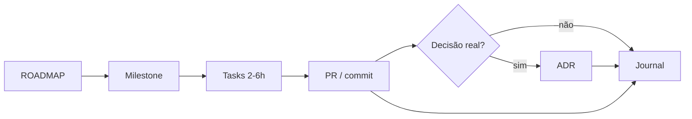

# Milestones — índice

Cada milestone é uma entrega demonstrável. Tasks ficam em [`../tasks/`](../tasks/).

## Fases

| Fase              | Milestones | Foco                                               |
| ----------------- | ---------- | -------------------------------------------------- |
| **Fundação**      | M00, M01   | Monorepo + infra mínima                            |
| **Domínio**       | M02, M06   | Estoque fechado; Shared Kernel **após** duplicação |
| **Integração**    | M03, M05   | Compose completo; PDV + 1º E2E                     |
| **Mensageria**    | M04, M08   | Outbox, Rabbit, correlation id; BullMQ             |
| **Consistência**  | M07, M09   | Saga; cache                                        |
| **Sincronização** | M10, M11   | Sync Engine MVP + completo                         |
| **Operação**      | M12–M15    | OTel, auth, CI, produção                           |

## Histórias de negócio → milestones

| #   | História                     | Milestone(s) |
| --- | ---------------------------- | ------------ |
| 1   | Um produto foi criado        | M01, M02     |
| 2   | Esse produto chegou ao PDV   | M04, M05     |
| 3   | Esse produto foi vendido     | M07          |
| 4   | O estoque baixou             | M07          |
| 5   | A venda foi cancelada        | M07          |
| 6   | O ERP descobriu essa mudança | M10, M11     |

## Lista

| ID                                | Milestone                          | Fase          | Status   |
| --------------------------------- | ---------------------------------- | ------------- | -------- |
| [M00](./M00-monorepo.md)          | Monorepo pnpm                      | Fundação      | parcial  |
| [M01](./M01-infra-minima.md)      | Infra mínima + estoque base        | Fundação      | pendente |
| [M02](./M02-estoque-completo.md)  | Estoque completo + Testcontainers  | Domínio       | pendente |
| [M03](./M03-infra-completa.md)    | Infra completa (compose)           | Integração    | pendente |
| [M04](./M04-mensageria-outbox.md) | RabbitMQ + Outbox + correlation id | Mensageria    | pendente |
| [M05](./M05-pdv-primeiro-e2e.md)  | PDV mínimo + 1º E2E                | Integração    | pendente |
| [M06](./M06-shared-kernel.md)     | Shared Kernel (extrair após dor)   | Domínio       | pendente |
| [M07](./M07-saga.md)              | Saga venda ↔ estoque               | Consistência  | pendente |
| [M08](./M08-bullmq.md)            | BullMQ + workers                   | Mensageria    | pendente |
| [M09](./M09-cache-redis.md)       | Cache Redis                        | Consistência  | pendente |
| [M10](./M10-sync-mvp.md)          | Sync Engine MVP                    | Sincronização | pendente |
| [M11](./M11-sync-completo.md)     | Sync Engine completo               | Sincronização | pendente |
| [M12](./M12-observabilidade.md)   | OpenTelemetry + ops                | Operação      | pendente |
| [M13](./M13-autenticacao.md)      | Autenticação                       | Operação      | pendente |
| [M14](./M14-ci-e2e.md)            | CI/CD + E2E completo               | Operação      | pendente |
| [M15](./M15-producao.md)          | Produção simulada                  | Operação      | pendente |

## Fluxo de trabalho

