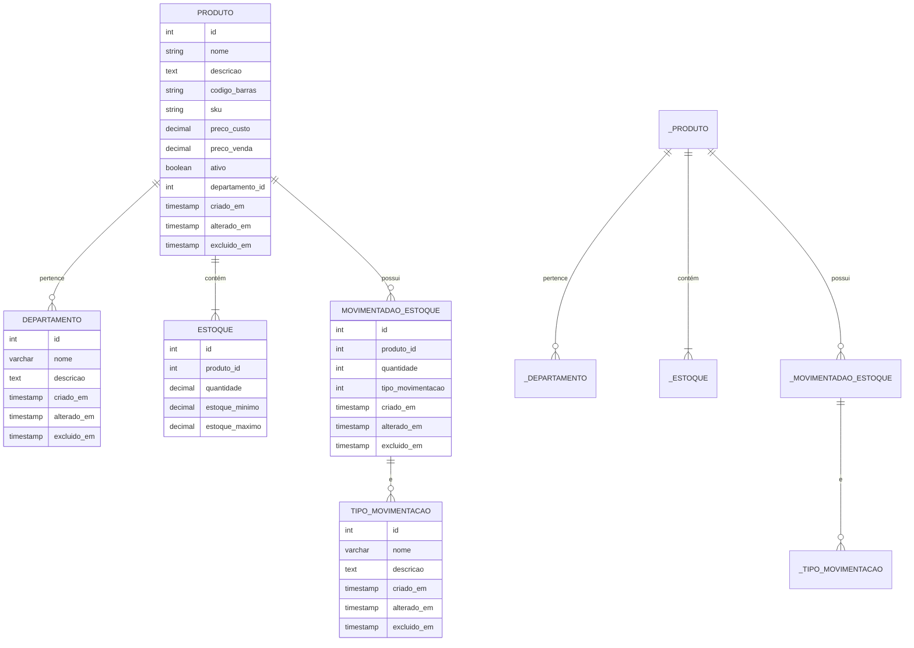

# Microserviço de Estoque

## Introdução

Este presente microserviço tem por objetivo o gerenciamento de produtos e estoque. Com um banco próprio e rotas.

## Arquitetura

### Modelagem do Banco de Dados

- **Diagrama Entidade Relacionamento**

Fluxo de cadastro de produto

### TODO: Fluxo de Cadastro de Produto

- Recebimento da requisição
- Validação
- Regras de negócio
- Persistência
- Publicação de evento
- Resposta da API
  Fluxo de movimentação de estoque

### TODO: Fluxo de Movimentação de Estoque

- Entrada
- Saída
- Ajuste
- Atualização do estoque
- Registro da movimentação
  Estrutura do projeto

### TODO: Estrutura de Pastas

Explicar o papel de:

- modules
- domain
- application
- infra
- shared
  Tratamento de erros

### TODO: Error Handler

Documentar:

- Erros de domínio
- Erros do banco
- Erros do Drizzle
- Erros HTTP
  Eventos

### TODO: Eventos publicados

ProdutoCriado

ProdutoAtualizado

EstoqueAtualizado

MovimentacaoRegistrada
Integração com Redis

### TODO: Redis

- Cache
- Pub/Sub
- Filas
  AI SDK

### TODO: Inteligência Artificial

Explicar:

- Onde a IA é utilizada
- Objetivo
- Ferramentas
- Prompts
  Testes

### TODO: Testes

- Unitários
- Integração
- End-to-End

## Roadmap

- [x] CRUD de departamentos
- [ ] CRUD de produtos
- [ ] Movimentação de estoque
- [ ] Publicação de eventos no Redis
- [ ] Consumo de eventos
- [ ] Cache de produtos
- [ ] Autenticação entre microserviços
- [ ] Observabilidade (logs e métricas)
- [ ] IA para classificação de produtos
- [ ] Testes de integração
- [ ] Docker Compose completo
