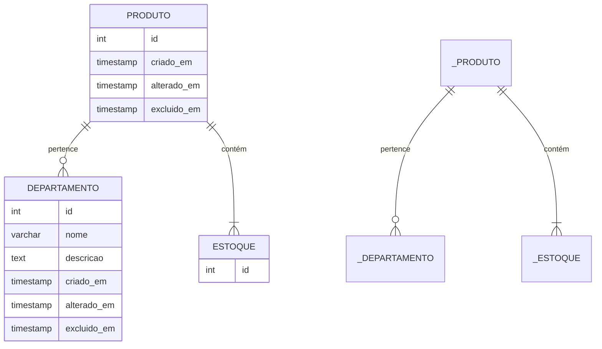

# Microserviço de Estoque

## Introdução

Este presente microserviço tem por objetivo o gerenciamento de produtos e estoque. Com um banco próprio e rotas.

## Arquitetura

### Modelagem do Banco de Dados

- **Diagrama Entidade Relacionamento**

- Modelagem da
